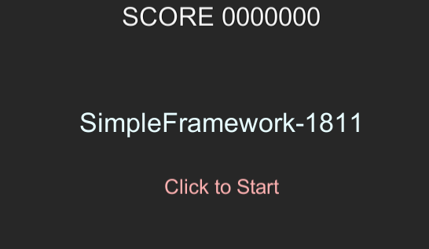
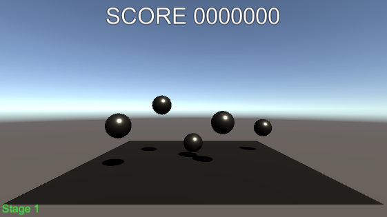
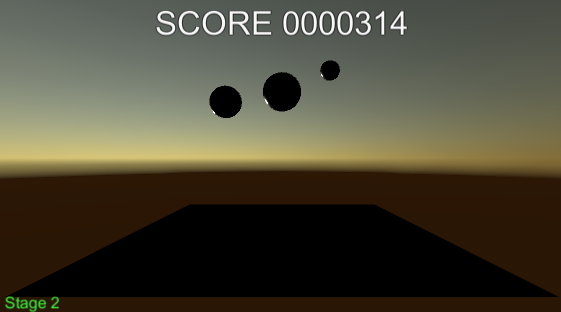
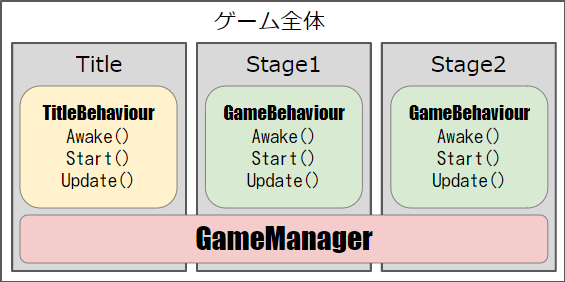

# SimpleFramework1811
Unity用の簡易フレームワーク2018年11月版。

以下の機能を集約したGameManagerオブジェクトプレハブと、デモシーンです。

- スコアとステージ数を、シーンを跨いで記録
- スコアとステージ数の表示
- フェードを伴うシーンの切り替え
- BGM再生
- SE再生(2Dやシステム音用)

## バージョン情報
- Unity2017.x以降用

## 動作デモ
本リポジトリーをクローンするか、ダウンロードして展開したフォルダーをUnityで開くと、**GameManager**プレハブを利用したデモプロジェクトを確認できます。

*Project*ウィンドウから`AM1GameManager/Demo/Scenes`フォルダーを開いて、`DemoTitle`をダブルクリックして開いたら、Playしてください。

クリックしたらゲーム開始します。

マウス操作で、跳ねているボールを取っていくゲームです。

ステージは2つあります。2ステージクリアすると、タイトルに戻ります。

### 確認できる機能
- ゲーム開始時の初期化処理
- シーン切り替え時のフェードイン/アウト
- BGM、SEの再生
- シーンを跨いだBGM再生
- スコア、ステージ数の描画
- シーンを跨いだスコア、ステージ数の保持

---

# アセットを組み込み
**GameManagerプレハブ**をプロジェクトに組み込む方法です。

- 新規でプロジェクトを作成するか、既存のプロジェクトをUnity2017.4以降で開きます
- [こちら](https://github.com/am1tanaka/SimpleFramework1811/releases)から、最新版の`SimpleFramework1811.unitypackage`をダウンロードします
- ダウンロードしたファイルをダブルクリックするか、Unityの*Project*ウィンドウにドラッグ＆ドロップしてインポートします
- *Project*ウィンドウに`AM1GameManager`フォルダーが追加されます。この中に必要なアセットがまとまっています
- 最初に起動したいシーンすべてに、`AM1GameManager/Prefabs`フォルダー内の`GameManager`プレハブを配置してください

以上で組み込み完了です。

## 基本情報
**GameManagerオブジェクト**は、**Don't Destory On Load**が設定されるので、シーンが変わっても存在し続けます。

**GameManagerスクリプト**はシングルトンです。こちらもデータが破棄されることはありません。このスクリプトに定義したプロパティ（変数）は、シーンが切り替わっても記録され続けます。ゲーム中にずっと記録しておきたいパラメーターは、このクラスに追加して管理するとよいでしょう。

## 既存のプロジェクトへ組み込む際の注意
- 既存のプロジェクトに`GameManager`や`Singleton`スクリプトがあると、名前が衝突します。一方のスクリプト名を変更するか、ネームスペース内に入れるなどしてください。

---

# GameManagerプレハブの制御
**GameManagerプレハブ**の機能を使う方法です。

## 前提となる考え方
Unityのシーン管理のコツです。

**ゲーム全体を管理**するためのマネージャーと、**各シーンを管理**するためのマネージャーを**分けて**作りましょう！

ゲーム全体で必要な機能は、ピンクで表した`GameManager`に実装します。これが本リポジトリーで提供するプレハブです。

この`GameManager`に、**シーン別の機能は一切加えないこと**が大切です。それをやると、シーンを切り分けるための`if`文が必要になったり、シーン内のオブジェクトの参照が消えたりして大変なことになります。このようなやってはいけないことを**アンチパターン**と言います。

ゲーム全体を管理する**GameManager**は、マルチシーンにしたり、今回のように**DontDestroyOnLoad**を設定して、永続させるようにします。そして、データの取り出しや設定用のメソッドやプロパティを提供して、各シーンから必要に応じてアクセスしてもらうようにします。

各シーンを管理するためのオブジェクトは、通常のオブジェクトやスクリプトにして、シーンが読み込まれるたびに新規に作成され、完了したら破棄されるようにしておきます。このようなシーン専用の管理オブジェクト＆スクリプトを、ゲーム全体の管理オブジェクトと別に持たせることで、**シーンの切り替え時に変わってはいけないものは`GameManager`に実装**し、**シーンの切り替え時に初期化が必要であったり、シーン内のインスタンスを利用するものはシーン毎の管理オブジェクトに実装**すれば、スッキリとした設計にできます。

## BGMやSEの利用
BGMやSEは、`GameManager`オブジェクトの`SoundManager`コンポーネントに音源と名前を登録して、あとはメソッドで再生を制御します。

### 音源の設定
- 利用するMP3やOGG、Wave形式の音源を、プロジェクトに加えておきます
- *Hierarchy*ウィンドウで、*GameManager*オブジェクトをクリックして選択します
- *Inspector*ウィンドウの*SoundManager*コンポーネントのBGM欄の左の三角アイコンをクリックして開きます

## ゲームの初期化処理

## シーンの切り替え

## スコアやステージ数の表示/非表示切り替え

---

# 利用アセット

## BGM/SE
本アセットに含まれるサンプルのBGMとSEは魔王魂さんのものです。

https://maoudamashii.jokersounds.com/

## Singleton.cs
シングルトンのスクリプトは、GitHubの[UnityCommunity](https://github.com/UnityCommunity/)で公開されている[UnitySingleton](https://github.com/UnityCommunity/UnitySingleton)を組み込みました。
